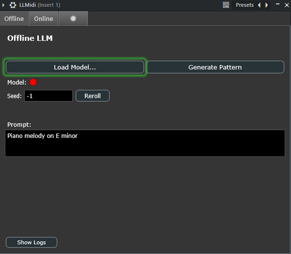
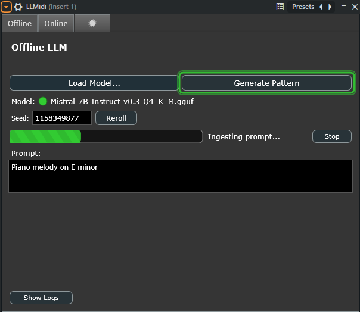
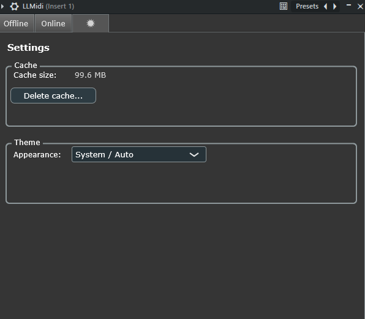
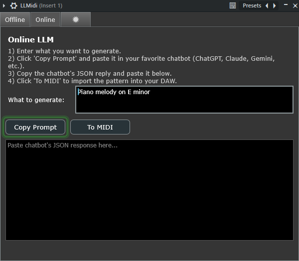
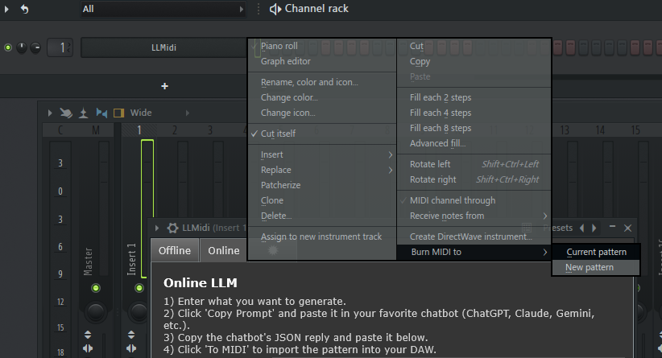
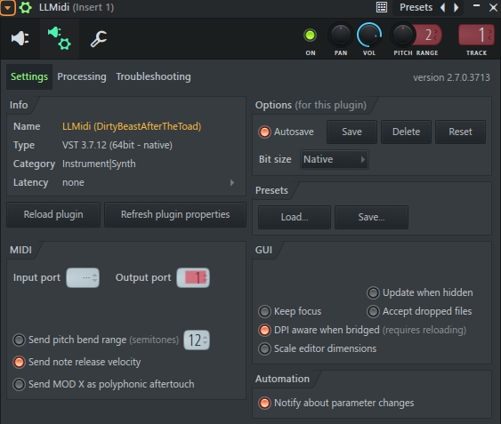

# LLMidi

**LLMidi** is a JUCE-based VST3 plugin that generates musical MIDI patterns using large language models (LLMs).  
It can operate in two modes:

- **Offline mode (Windows only)** – Use a local `GGUF` model through an embedded `llama.cpp` backend.
- **Online mode (Windows and macOS)** – Use any web-based chatbot (ChatGPT, Claude, Gemini, etc.) to generate musical patterns without running a local model.

---

## Table of Contents

1. [Overview](#overview)
2. [End-User Guide](#end-user-guide)
   - [Installation](#installation)
   - [Offline Mode (Windows)](#offline-mode-windows)
   - [Online Mode (Windows--macos)](#online-mode-windows--macos)
   - [Exporting MIDI to Your DAW](#exporting-midi-to-your-daw)
   - [Cache & Uninstall Notes](#cache--uninstall-notes)
3. [Developer Guide](#developer-guide)
   - [Project Structure](#project-structure)
   - [Building from Source](#building-from-source-windows-only)
   - [Tweaking Behavior](#tweaking-behavior)
4. [Ethical concerns](#ethical-concerns)
5. [License & Credits](#license--credits)

---

## Overview

LLMidi translates natural-language prompts like

> “Piano melody on E minor”

into playable MIDI patterns, either through a local LLM (offline) or a chatbot interface (online).  
Internally, it parses structured event JSON and schedules MIDI playback in real time.

---

## End-User Guide

### Installation

#### Windows

1. Download the compiled **VST3** plugin from the releases page.
2. Copy `LLMidi.vst3` into:
   ```
   C:\Program Files\Common Files\VST3\
   ```
3. Launch your DAW and rescan plugins.

#### macOS

LLMidi’s **online mode** works fully on macOS.  
You can build the plugin from source (see developer section) or install a `.vst3` binary if provided.

Copy `LLMidi.vst3` into either:

```
/Library/Audio/Plug-Ins/VST3/        (system-wide)
~/Library/Audio/Plug-Ins/VST3/       (per user)
```

Then rescan your plugins in your DAW.

> Note: Logic Pro does not support VST3. Use Ableton Live, Reaper, Cubase, Bitwig, or Studio One on macOS.

---

### Offline Mode (Windows)

Offline mode runs a local **LLM** via the embedded `llama.cpp` backend.

<p align="center">
  
</p>

1. Download a compatible `.gguf` model from [Hugging Face](https://huggingface.co).  
   Recommended example:
   ```
   Mistral-7B-Instruct-v0.3-Q4_K_M.gguf
   ```
2. Create a folder to store models, for example:
   ```
   C:\Users\<you>\Documents\LLMidi\Models\
   ```
3. Launch LLMidi and open the **Offline** tab.
4. Click **Load Model...**, choose your `.gguf` model.
5. Wait for the status dot to turn green (model loaded).
6. Type your musical prompt and click **Generate Pattern**.

You’ll see a progress bar while the model generates the pattern.

<p align="center">
  
</p>

When done, the plugin outputs a live MIDI pattern inside your DAW.

#### Performance & Cache Notes

- The **first generation** using a new model will take significantly longer — this is normal.  
  LLMidi builds a persistent **cache** for that specific model to speed up future generations.
- Each model has its own cache file stored in:
  ```
  C:\Users\<you>\AppData\Roaming\LLMidi\
  ```
  (filename ending in `.session`)
- Changing models or modifying low-level parameters (e.g., context size or static prompt) will trigger a cache rebuild.  
  The next generation will again take longer while the cache is created.
- Once cached, later generations will be much faster.

<p align="center">
  
</p>

---

### Online Mode (Windows & macOS)

The online mode uses your favorite chatbot instead of a local model.

<p align="center">
  
</p>

1. Open the **Online** tab.
2. Type your description, e.g. “Fast jazz drum groove in 7/8”.
3. Click **Copy Prompt**.
4. Paste it into your chatbot (ChatGPT, Claude, Gemini, etc.).
5. Copy the chatbot’s pure JSON output (no code blocks or markdown).
6. Paste it into the **Response** box in LLMidi.
7. Click **To MIDI** to import the pattern into your DAW.

#### Why use online mode

- Online mode is **platform-independent**, requires no local model, and can leverage **much larger LLMs** (tens of billions of parameters).
- Larger online models usually generate **more coherent and musically aware patterns**, especially for complex harmonic progressions.
- However, note that **cloud LLMs consume significant energy resources**. If you’re experimenting heavily, consider using offline mode to reduce environmental impact.

---

### Exporting MIDI to Your DAW

LLMidi is a **MIDI-generating plugin**. After a sequence is ready, you can record or render its MIDI output.

#### In FL Studio (Windows)

1. Generate the sequence in LLMidi.
2. Set the MIDI Output Port (e.g. **Port 1**).
3. Place a **dummy note** in the piano roll covering the duration of the pattern.
4. In the Channel Rack, **right-click the plugin** and choose:
   ```
   Burn MIDI to new pattern
   ```
   <p align="center">
     
   </p>
5. The generated notes will appear as editable MIDI in a new pattern.

##### Preview Option

You can also preview the generated notes before burning them:

- Load any synth plugin.
- Set its MIDI **Input Port** to the same value as LLMidi’s **Output Port**.
- Press play — the synth will perform the generated pattern in real time.

<p align="center">
  
</p>

#### In Other DAWs

- **Ableton Live (Windows/macOS)** — Create a MIDI track using LLMidi as the source. Arm and record to capture the generated notes.
- **Reaper / Cubase / Bitwig / Studio One** — Route the MIDI output from LLMidi to another track and record or freeze it.
- **Logic Pro (macOS)** — Not supported, since Logic uses AU format only (VST3 not supported).

---

### Cache & Uninstall Notes

#### Cache Location

Each LLM model used in offline mode creates its own cache file in:

```
C:\Users\<you>\AppData\Roaming\LLMidi\
```

These files are reused automatically to speed up generation.

#### When to Clear Cache

- After changing model parameters (context size, prompt template, etc.)
- When a model update introduces compatibility issues
- When freeing disk space

You can clear the cache using the **Settings** tab in the plugin or manually delete the `.session` files.

#### Uninstalling LLMidi

To fully remove LLMidi:

1. Delete `LLMidi.vst3` from your VST3 plugin directory.
2. Delete the cache folder:
   ```
   C:\Users\<you>\AppData\Roaming\LLMidi\
   ```

---

## Developer Guide

### Project Structure

```
LLMidi/
│
├─ Source/              → Core plugin source (processor, UI, pages)
├─ JuceLibraryCode/     → Auto-generated JUCE project code
├─ third_party/         → Local build of llama.cpp (Windows)
├─ Models/              → Optional local GGUF model directory
├─ Builds/              → Platform-specific build folders
├─ LLMidi.jucer         → Projucer project definition
└─ .gitignore, .gitmodules, etc.
```

_(image: [placeholder_project_structure.png])_

---

### Building from Source (Windows only)

#### Requirements

- [JUCE](https://juce.com) framework
- **Visual Studio 2022** on Windows
- **Xcode** on macOS (for online-only build)
- C++17 toolchain

#### Steps

1. Clone the repo:
   ```
   git clone https://github.com/DirtyBeastAfterTheToad/LLMidi.git
   cd LLMidi
   ```
2. Open `LLMidi.jucer` in **Projucer**.
3. Add an exporter:
   - Visual Studio 2022 for Windows
4. Click **Save and Open in IDE**.
5. Build the project (**F6** or Build → Build Solution).
6. The compiled plugin appears under:
   ```
   Builds\VisualStudio2022\x64\Release\VST3\LLMidi.vst3\Contents\x86_64-win
   ```
7. Copy the plugin to your system’s VST3 directory.

#### macOS Online-Only Notes

For mac builds, you can exclude or disable these source files (used only for offline mode):

- `LlamaRunner.*`
- `LlmGenAdapter.*`
- `BackgroundGenerator.*`
- Any references to them in `PluginProcessor.*`

This should produce a clean online-only build that runs fully on macOS. (Untested)

---

### Tweaking Behavior

For developers customizing the plugin:

- **Model parameters:**  
  Edit defaults in  
  `PluginProcessor.cpp → requestLoadModelFromFile()`  
  (change `n_ctx`, `n_batch`, or default seed).

  > Note: Changing these parameters or the built-in static prompt will invalidate the existing cache and trigger a rebuild.  
  > The next generation will take longer while the cache is recreated.

- **UI layout:**  
  Adjust layout and controls in  
  `OfflinePage.cpp`, `OnlinePage.cpp`, or `SettingsPage.cpp`.

- **Sequence parsing & scheduling:**  
  The pipeline is implemented in:

  - `LlmSequenceParser.*`
  - `MidiScheduler.*`
  - `SequenceModel.*`

- **Cache directory:**  
  Defined in  
  `PluginEditor.cpp → cacheDirPath()`.

---

## Ethical Concerns

The integration of AI into music creation raises legitimate ethical questions.  
It’s important to acknowledge that this technology is already here and its potential use in creative work is inevitable.

The philosophy behind **LLMidi** is to **empower musicians**, not replace them.  
This plugin is designed as a **creative assistant**, not a fully autonomous composer.  
It helps you experiment, discover new rhythmic or harmonic ideas, or overcome creative blocks while leaving artistic direction, taste, and emotion firmly in human hands.

LLMidi does **not** attempt to produce finished songs or copyrighted imitations, and it encourages users to remain intentional and expressive in their craft.  
The goal is to keep the **artist at the center of creation**, using AI as a flexible, transparent tool for inspiration , not as a substitute for creativity itself.

---

## License & Credits

LLMidi is **open-source**.  
You are free to modify or integrate it in your own projects, but please **credit the original author** if you do so.

This project includes:

- [`llama.cpp`](https://github.com/ggerganov/llama.cpp) — local inference backend
- [`JUCE`](https://juce.com) — audio plugin framework and UI engine

---

> © 2025 — LLMidi Project  
> Author: DirtyBeastAfterTheToad  
> Free to use and modify with attribution.
